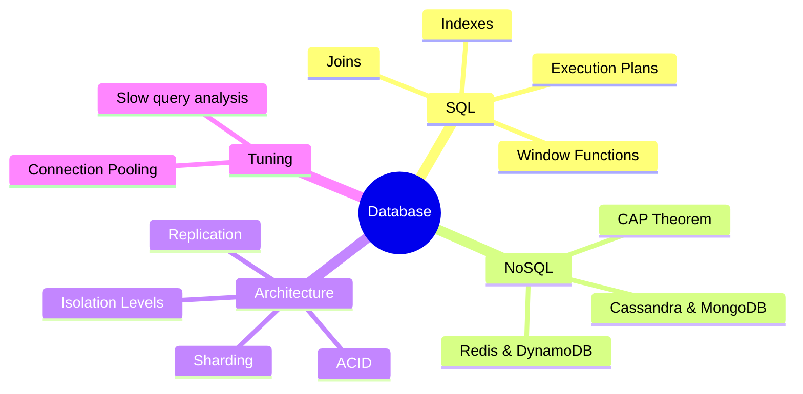

# Database Interview Prep

Deep dives into SQL, NoSQL, and Database Performance Tuning for SDE-2 interviews.

### 📚 Topic Visualization

### 📚 Topic Master Index

| Topic / Question | Read Document | Difficulty Level |
| :--- | :--- | :--- |
| 4 Normal Forms of Database Design | [Open ↗](/database/normalization-levels/) | ⭐⭐⭐ Hard |
| ACID vs. BASE | [Open ↗](/database/acid-vs-base/) | ⭐⭐⭐ Hard |
| B-Tree vs. B+ Tree Internals | [Open ↗](/database/b-tree-vs-b-plus-tree/) | ⭐⭐ Medium |
| CAP Theorem and NoSQL Database Trade-offs | [Open ↗](/database/cap-theorem-nosql/) | ⭐⭐⭐ Hard |
| Clustered vs. Non-Clustered Indexes | [Open ↗](/database/clustered-vs-non-clustered/) | ⭐ Easy |
| Columnar vs. Row-Oriented Storage | [Open ↗](/database/columnar-vs-row-storage/) | ⭐⭐ Medium |
| Consistent Hashing (Detailed) | [Open ↗](/database/consistent-hashing-vnodes/) | ⭐⭐⭐ Hard |
| Database Indexing Deep-Dive | [Open ↗](/database/indexing-deep-dive/) | ⭐⭐ Medium |
| Database Isolation Levels and Anomalies | [Open ↗](/database/isolation-levels/) | ⭐⭐ Medium |
| Database Replication Strategies | [Open ↗](/database/database-replication-strategies/) | ⭐ Easy |
| Database Replication and Read Replicas | [Open ↗](/database/replication-read-replicas/) | ⭐⭐ Medium |
| Database SQL: Window Functions and Advanced Queries | [Open ↗](/database/sql-window-functions/) | ⭐⭐ Medium |
| Database Sharding Patterns | [Open ↗](/database/database-sharding-patterns/) | ⭐⭐ Medium |
| Database View vs. Materialized View | [Open ↗](/database/views-vs-materialized/) | ⭐⭐ Medium |
| Databases: B-Tree vs B+ Tree Internals | [Open ↗](/database/b-plus-tree-internals/) | ⭐⭐⭐ Hard |
| Databases: Columnar vs. Row Storage | [Open ↗](/database/row-vs-columnar/) | ⭐⭐ Medium |
| Databases: Sparse vs. Dense Indexes | [Open ↗](/database/sparse-vs-dense-indexes/) | ⭐⭐⭐ Hard |
| Horizontal vs. Vertical Partitioning | [Open ↗](/database/database-partitioning-detailed/) | ⭐⭐⭐ Hard |
| Indexing and Optimization | [Open ↗](/database/database-indexing-optimization/) | ⭐⭐ Medium |
| MVCC (Multi-Version Concurrency Control) | [Open ↗](/database/mvcc-internals/) | ⭐⭐ Medium |
| NoSQL: Graph Databases (Neo4j) | [Open ↗](/database/graph-databases-neo4j/) | ⭐⭐ Medium |
| NoSQL: Time-Series Databases (InfluxDB) | [Open ↗](/database/time-series-databases/) | ⭐⭐⭐ Hard |
| NoSQL: Wide-Column Stores (Cassandra Internals) | [Open ↗](/database/wide-column-stores/) | ⭐⭐ Medium |
| Normalization vs. Denormalization Rules | [Open ↗](/database/normalization-denormalization/) | ⭐⭐ Medium |
| Partial Indexes (SQL Optimization) | [Open ↗](/database/partial-indexes-detailed/) | ⭐⭐ Medium |
| Sharding vs Partitioning | [Open ↗](/database/sharding-partitioning/) | ⭐ Easy |
| Star Schema vs. Snowflake Schema | [Open ↗](/database/star-vs-snowflake/) | ⭐⭐⭐ Hard |
| Transaction Isolation Levels | [Open ↗](/database/isolation-levels-detailed/) | ⭐⭐⭐ Hard |
| Write-Ahead Logging (WAL) Internals | [Open ↗](/database/write-ahead-logging/) | ⭐⭐⭐ Hard |
