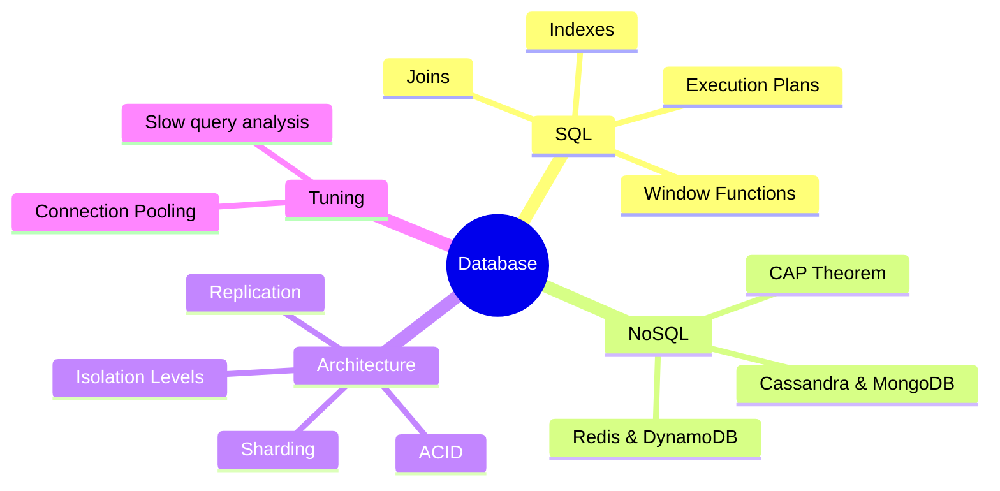

# Database Interview Prep

Deep dives into SQL, NoSQL, and Database Performance Tuning for SDE-2 interviews.

### 📚 Topic Visualization

### 📚 Topic Index

| Category | Topics Covered | Difficulty Level |
| :--- | :--- | :--- |
| **SQL Deep Dives** | Joins, Indexes, Execution Plans, Window Functions | ⭐⭐ Medium |
| **ACID & Transactions** | Isolation levels, Anomalies (Dirty Read, Phantom Read) | ⭐⭐⭐ Hard |
| **Scalability** | Sharding, Partitioning, Replication, Read Replicas | ⭐⭐⭐ Hard |
| **NoSQL** | CAP Theorem, Cassandra, MongoDB, Redis, DynamoDB | ⭐⭐ Medium |
| **Performance Tuning** | Slow query analysis, Connection Pooling, Caching | ⭐⭐⭐ Hard |
