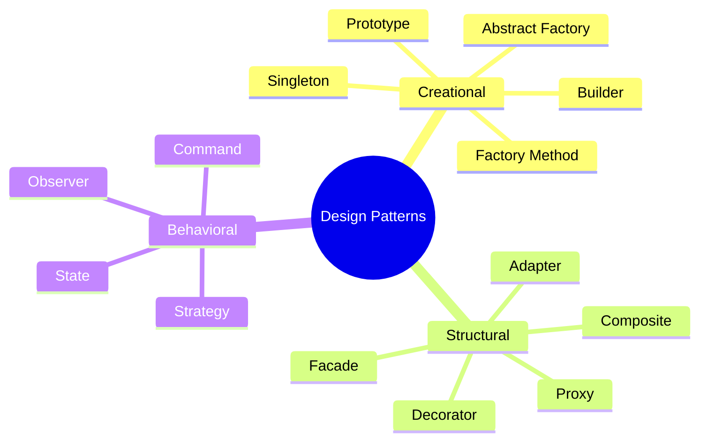

# Design Patterns Interview Prep

An exhaustive guide on the 23 Gang of Four (GoF) design patterns and their real-world implementations, essential for Low-Level Design (LLD) interviews.

### 📚 Topic Visualization

## Architectural Foundation

Before attacking complex structural or creational patterns, it's mandatory to understand the five foundational principles of OOP architecture. Every advanced design pattern fundamentally exists to solve violations of the SOLID principles.

| Topic | Description & Study Goal | Difficulty Level | Read Document |
|---|--------|----|:---|
| **SOLID Principles** | SRP, OCP, LSP, ISP, and DIP. Essential object-oriented design rules. | ⭐ Easy | [Open ↗](/interview-ready/design-patterns/solid-principles/) |

## Master Pattern Index

### Creational Patterns

| Pattern | Description & Study Goal | Difficulty Level | Read Document |
|---|--------|----|:---|
| **Singleton** | Restricts object creation to a single instance. Focus on thread safety. | ⭐⭐ Medium | [Open ↗](https://refactoring.guru/design-patterns/singleton) |
| **Factory Method** | Provides an interface for creating objects in a superclass. | ⭐ Easy | [Open ↗](https://refactoring.guru/design-patterns/factory-method) |
| **Abstract Factory** | Produce families of related objects without specifying concrete classes. | ⭐⭐⭐ Hard | [Open ↗](https://refactoring.guru/design-patterns/abstract-factory) |
| **Builder** | Constructs complex objects step by step. | ⭐ Easy | [Open ↗](https://refactoring.guru/design-patterns/builder) |
| **Prototype** | Cloning existing objects without coupling to their classes. | ⭐ Easy | [Open ↗](https://refactoring.guru/design-patterns/prototype) |

### Structural Patterns

| Pattern | Description & Study Goal | Difficulty Level | Read Document |
|---|--------|----|:---|
| **Adapter** | Allows objects with incompatible interfaces to collaborate. | ⭐ Easy | [Open ↗](https://refactoring.guru/design-patterns/adapter) |
| **Decorator** | Dynamically attach new behaviors to objects without subclassing. | ⭐⭐ Medium | [Open ↗](https://refactoring.guru/design-patterns/decorator) |
| **Facade** | Provides a simplified interface to a complex subsystem. | ⭐ Easy | [Open ↗](https://refactoring.guru/design-patterns/facade) |
| **Proxy** | Provides a substitute or placeholder for Lazy-loading/Access control. | ⭐⭐ Medium | [Open ↗](https://refactoring.guru/design-patterns/proxy) |
| **Composite** | Lets you compose objects into tree structures. | ⭐⭐⭐ Hard | [Open ↗](https://refactoring.guru/design-patterns/composite) |

### Behavioral Patterns

| Pattern | Description & Study Goal | Difficulty Level | Read Document |
|---|--------|----|:---|
| **Observer** | Publish-Subscribe pattern used heavily in event-driven systems. | ⭐ Easy | [Open ↗](https://refactoring.guru/design-patterns/observer) |
| **Strategy** | Defines a family of algorithms, encapsulating each one dynamically. | ⭐ Easy | [Open ↗](https://refactoring.guru/design-patterns/strategy) |
| **Command** | Turns a request into a stand-alone object (Undo/Redo usage). | ⭐⭐ Medium | [Open ↗](https://refactoring.guru/design-patterns/command) |
| **State** | Lets an object alter its behavior when internal state changes. | ⭐⭐ Medium | [Open ↗](https://refactoring.guru/design-patterns/state) |

> **Context:** Understanding these patterns provides tremendous clarity for building extensible software. In actual interviews, never force a pattern; use them when the code strongly necessitates avoiding tightly coupled dependencies.

### 📝 Frequently Asked Interview Questions

For a detailed analysis, including code snippets, comparisons, and heavily requested theoretical discussions, check out our deep-dive guide:

👉 **[Read the Comprehensive Design Pattern Interview Questions here! ↗](/interview-ready/design-patterns/interview-questions/)**
