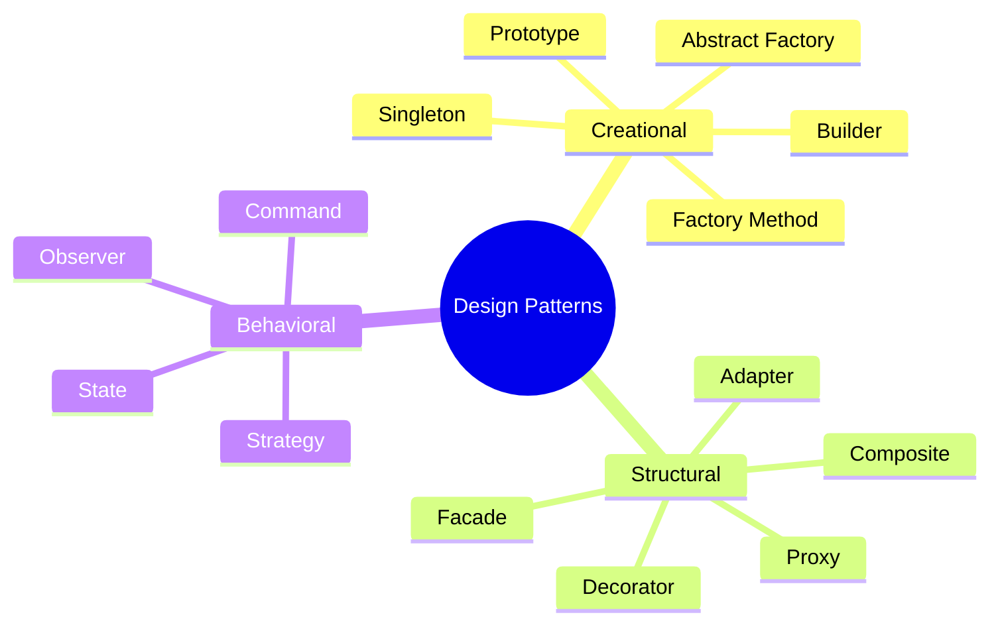

# Design Patterns Interview Prep

An exhaustive guide on the 23 Gang of Four (GoF) design patterns and their real-world implementations, essential for Low-Level Design (LLD) interviews.

### 📚 Topic Visualization

### 📚 Detailed Study & References

| Topic / Pattern | Description & Study Goal | Reference / External Reading |
| :--- | :--- | :--- |
| **Singleton** | Restricts object creation to a single instance. Focus on thread safety (Double-Checked Locking). | [Refactoring.Guru ↗](https://refactoring.guru/design-patterns/singleton) |
| **Factory Method** | Provides an interface for creating objects in a superclass, allowing subclasses to alter creation. | [Refactoring.Guru ↗](https://refactoring.guru/design-patterns/factory-method) |
| **Abstract Factory** | Lets you produce families of related objects without specifying concrete classes. | [Refactoring.Guru ↗](https://refactoring.guru/design-patterns/abstract-factory) |
| **Builder** | Constructs complex objects step by step. Extensively used in modern Java (e.g., Lombok `@Builder`). | [Refactoring.Guru ↗](https://refactoring.guru/design-patterns/builder) |
| **Prototype** | Cloning existing objects without making code dependent on their classes. | [Refactoring.Guru ↗](https://refactoring.guru/design-patterns/prototype) |
| **Adapter** | Allows objects with incompatible interfaces to collaborate. Think of legacy integration wrappers. | [Refactoring.Guru ↗](https://refactoring.guru/design-patterns/adapter) |
| **Decorator** | Dynamically attach new behaviors to objects. Seen heavily in Java IO (`BufferedReader`). | [Refactoring.Guru ↗](https://refactoring.guru/design-patterns/decorator) |
| **Facade** | Provides a simplified interface to a large body of complex APIs. | [Refactoring.Guru ↗](https://refactoring.guru/design-patterns/facade) |
| **Proxy** | Provides a substitute or placeholder. Useful for caching, access control, and lazy init. | [Refactoring.Guru ↗](https://refactoring.guru/design-patterns/proxy) |
| **Composite** | Lets you compose objects into tree structures (e.g., File system hierarchies). | [Refactoring.Guru ↗](https://refactoring.guru/design-patterns/composite) |
| **Observer** | Publish-Subscribe pattern. Critical for Message Queues and Event-driven systems. | [Refactoring.Guru ↗](https://refactoring.guru/design-patterns/observer) |
| **Strategy** | Defines a family of algorithms, encapsulating each one. Good for interchangeable business logic. | [Refactoring.Guru ↗](https://refactoring.guru/design-patterns/strategy) |
| **Command** | Turns a request into a stand-alone object. Great for undo/redo or job queues. | [Refactoring.Guru ↗](https://refactoring.guru/design-patterns/command) |
| **State** | Lets an object alter its behavior when its internal state changes (e.g., Vending Machine). | [Refactoring.Guru ↗](https://refactoring.guru/design-patterns/state) |

> **Context:** Understanding these patterns provides tremendous clarity for building extensible software. In actual interviews, never force a pattern; use them when the code strongly necessitates avoiding tightly coupled dependencies.

### 📝 Frequently Asked Interview Questions

For a detailed analysis, including code snippets, comparisons, and heavily requested theoretical discussions, check out our deep-dive guide:

👉 **[Read the Comprehensive Design Pattern Interview Questions here! ↗](/interview-ready/design-patterns/interview-questions/)**
