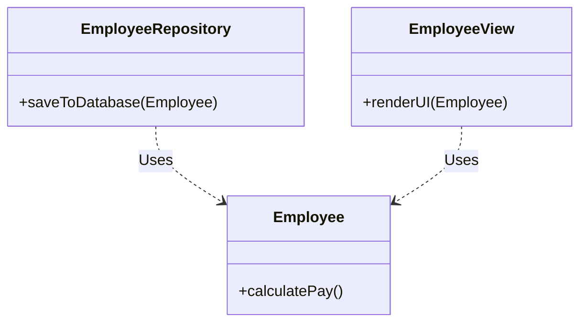
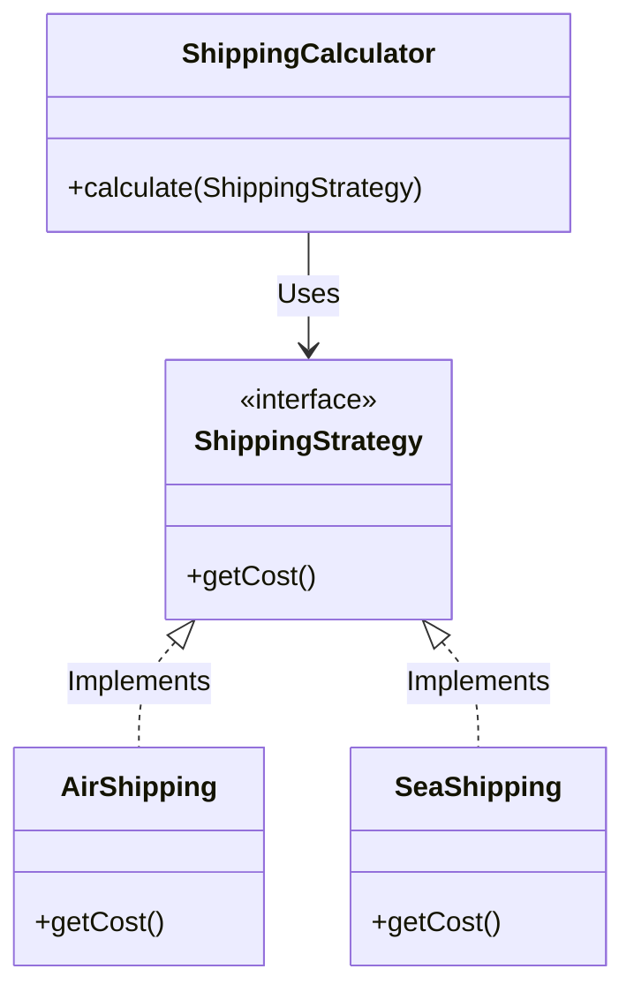
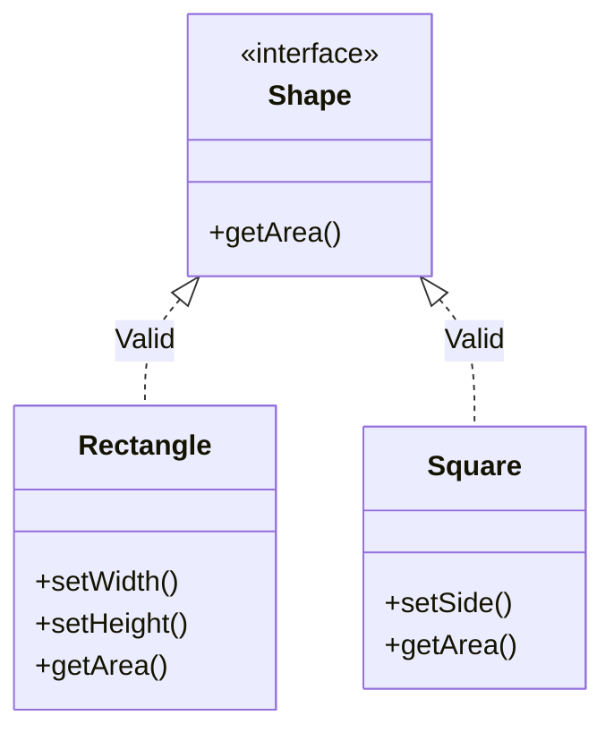
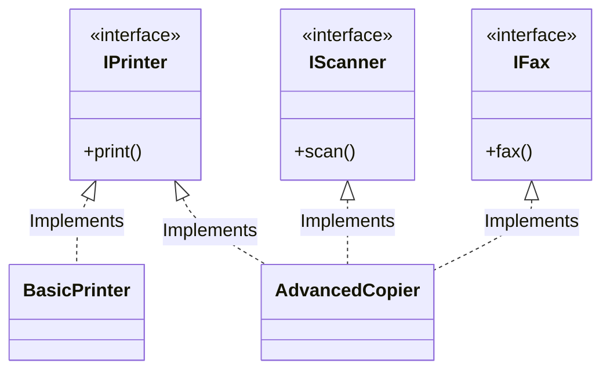
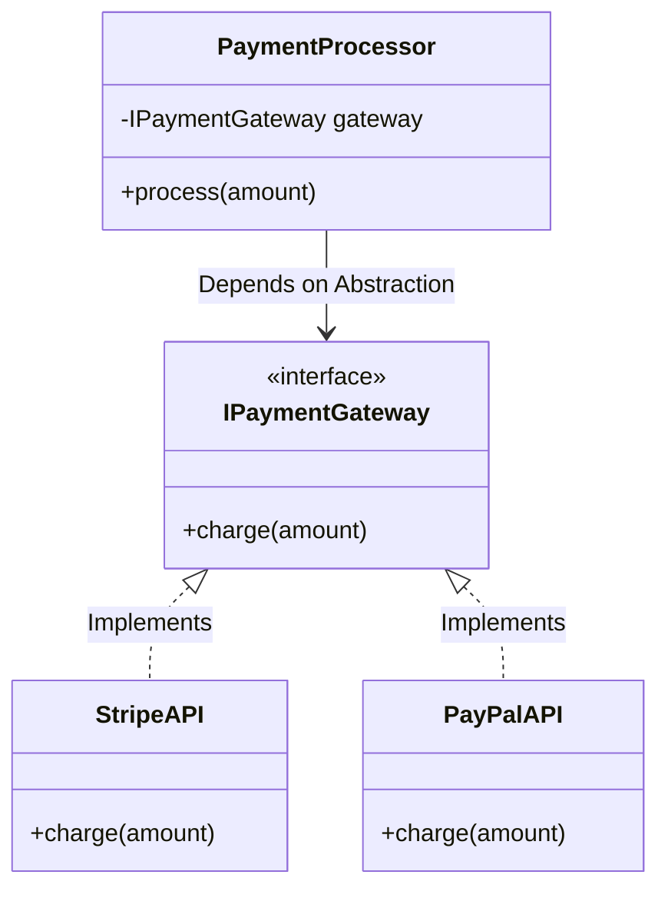

# 🏗️ SOLID Principles of Object-Oriented Design

The SOLID principles are five crucial design tenets that make software designs more understandable, flexible, and maintainable. They form the absolute foundation before learning advanced Gang of Four Design Patterns.

---

### **S** - Single Responsibility Principle (SRP)
**"A class should have one, and only one, reason to change."**
- **Meaning:** Every class, module, or function should have responsibility over a single part of the program's functionality.
- **Real-World Analogy:** Think of a restaurant. The Chef cooks the food, the Waiter serves it, and the Cashier handles the money. If the Chef stopped cooking to take payments and serve tables, the whole system would become chaotic and error-prone. Each role has one distinct reason to change.
- **Example:** If you have an `Employee` class, it should handle employee-specific logic (e.g., calculating pay). It should **not** handle saving the employee to the database or rendering the employee to a UI screen. Those responsibilities belong to an `EmployeeRepository` and an `EmployeeView`.

### **O** - Open/Closed Principle (OCP)
**"Software entities should be open for extension, but closed for modification."**
- **Meaning:** You should be able to add new functionality without changing existing code.
- **Real-World Analogy:** A standard electrical outlet. If you buy a new TV, you don't need to break open your living room wall and rewire the house to power it. The outlet is "closed for modification", but "open for extension" because you can just plug your new TV into the standard interface.
- **Example:** Use interfaces and abstract classes. Instead of writing a massive `switch` statement to calculate shipping costs for `Air`, `Ground`, and `Sea`, define a `ShippingStrategy` interface. Then, add new shipping methods by creating new classes that implement the interface, leaving the core calculator class completely untouched.

### **L** - Liskov Substitution Principle (LSP)
**"Subtypes must be substitutable for their base types without altering the correctness of the program."**
- **Meaning:** If class `B` is a subclass of class `A`, we should be able to replace `A` with `B` without disrupting the behavior of our program.
- **Real-World Analogy:** The classic "Duck" test. If it looks like a duck, quacks like a duck, but needs batteries to survive, you probably have a robot duck. If you drop a robot duck into an actual pond (substituting the base `Duck` type), it will short circuit and sink, unexpectedly breaking the system.
- **Example:** A classic violation is a `Square` inheriting from `Rectangle`. If you set the width of a `Square`, the height must also change to maintain the square property, violating the expected behavior of a true `Rectangle`. Prefer composition or stricter interface segregation over forced inheritance.

### **I** - Interface Segregation Principle (ISP)
**"Clients should not be forced to depend upon interfaces that they do not use."**
- **Meaning:** Create small, specific, client-focused interfaces rather than one large, generalized "fat" interface.
- **Real-World Analogy:** A smart Swiss Army Knife vs Individual Tools. If you just need to tighten a tiny screw, being forced to wield a heavy, 30-tool pocket knife with a saw and corkscrew dangling out is clumsy. You only want a screwdriver.
- **Example:** Instead of an `IMachine` interface with `print()`, `scan()`, and `fax()` methods (which forces a simple `Printer` class to implement dummy `scan()` and `fax()` methods), split it into `IPrinter`, `IScanner`, and `IFax`. Devices then implement only the behavioral interfaces they actually support.

### **D** - Dependency Inversion Principle (DIP)
**"High-level modules should not depend on low-level modules. Both should depend on abstractions. Abstractions should not depend on details. Details should depend on abstractions."**
- **Meaning:** You should depend on interfaces or abstract classes, not concrete implementations.
- **Real-World Analogy:** Plugging in a lamp. Your lamp has a generic two-prong plug (abstraction). It doesn't care if the wall socket is powered by a coal plant, a solar panel, or a nuclear reactor (implementation details). Because the lamp depends on the abstraction, you can swap the power source seamlessly without changing the lamp.
- **Example:** A `PaymentProcessor` should not instantiate a concrete `StripeAPI` class inside its methods. Instead, it should accept an `IPaymentGateway` interface via its constructor. This allows you to easily inject a `PayPalAPI` or a `MockAPI` for testing without modifying the core processor logic.

---

### Why is SOLID important for Interviews?

Almost all High-Level and Low-Level Design interview questions secretly test your adherence to SOLID. 
- If an interviewer asks to add a new requirement to your parking lot design (e.g., VIP spots), violating **OCP** will force you to rewrite your entire allocation class. 
- Using Dependency Injection (Spring/Dagger) directly enforces **DIP**, making your code easily testable.
