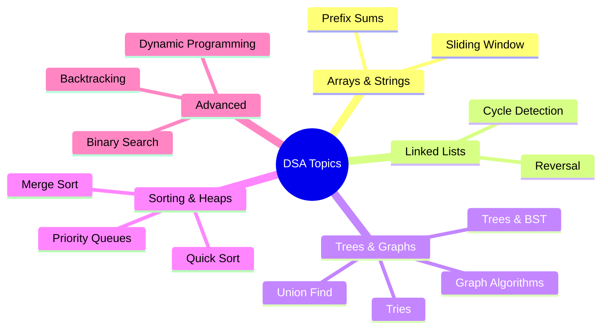

# DSA Interview Prep

Deep dives into Data Structures and Algorithms for SDE-2 interviews at top product companies.

### 📚 Topic Visualization

### 📚 Topic Index
| Topic / Pattern | Description | Difficulty Level |
| :--- | :--- | :--- |
| [Array & String: Sliding Window](sliding-window) | Sliding window techniques, variable and fixed size | ⭐⭐ Medium |
| [Binary Search Patterns](binary-search-patterns) | Searching in rotated arrays, monotonic search | ⭐⭐⭐ Hard |
| [Linked List](linked-list) | Reversal, cycle detection, fast & slow pointers | ⭐ Easy |
| [Trees & BST](trees-bst) | DFS, BFS, Lowest Common Ancestor, Traversals | ⭐⭐ Medium |
| [Graph Algorithms](graph-algorithms) | Dijkstra's, spanning trees, topological sort | ⭐⭐⭐ Hard |
| [Heaps & Priority Queues](heaps-priority-queues) | Top K elements, max/min heaps, K-way merge | ⭐⭐ Medium |
| [Dynamic Programming](dynamic-programming) | Memoization, tabulation, 1D/2D DP arrays | ⭐⭐⭐ Hard |
| [Sorting Algorithms](sorting-algorithms) | Merge sort, quick sort, cyclic sort, bucket sort | ⭐⭐ Medium |
| [Backtracking](backtracking) | Permutations, combinations, N-Queens problem | ⭐⭐⭐ Hard |
| [Prefix Sums & Segment Trees](prefix-sums-segment-trees) | Range queries, cumulative sum patterns | ⭐⭐⭐ Hard |
| [Tries](tries) | Prefix matching, autocomplete, string dictionaries | ⭐⭐ Medium |
| [Union Find (Disjoint Set)](union-find) | Connected components, Kruskal's algorithm | ⭐⭐ Medium |
