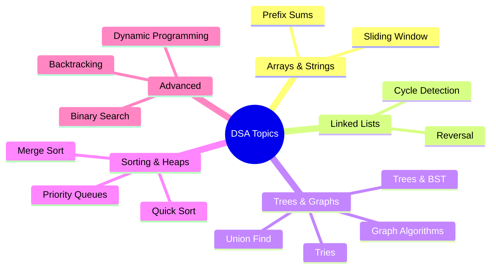

# DSA Interview Prep

Deep dives into Data Structures and Algorithms for SDE-2 interviews at top product companies.

### 📚 Topic Visualization

### 📚 Topic Master Index

| Topic / Question | Read Document | Difficulty Level |
| :--- | :--- | :--- |
| Backtracking: N-Queens, Permutations, Sudoku | [Open ↗](/dsa/backtracking/) | ⭐⭐ Medium |
| Binary Search Patterns and Variants | [Open ↗](/dsa/binary-search-patterns/) | ⭐⭐ Medium |
| Dynamic Programming: Patterns and Thinking | [Open ↗](/dsa/dynamic-programming/) | ⭐⭐ Medium |
| Graph Algorithms: BFS, DFS, Dijkstra, Topological Sort | [Open ↗](/dsa/graph-algorithms/) | ⭐⭐⭐ Hard |
| Heaps and Priority Queues | [Open ↗](/dsa/heaps-priority-queues/) | ⭐⭐⭐ Hard |
| Linked List: Cycle Detection, Reversal, and Merging | [Open ↗](/dsa/linked-list/) | ⭐⭐⭐ Hard |
| Prefix Sums and Difference Arrays | [Open ↗](/dsa/prefix-sums-segment-trees/) | ⭐ Easy |
| Sliding Window and Two Pointer Patterns | [Open ↗](/dsa/sliding-window/) | ⭐⭐⭐ Hard |
| Sorting Algorithms Internals and Merge Sort | [Open ↗](/dsa/sorting-algorithms/) | ⭐⭐⭐ Hard |
| Trees: Binary Trees, BSTs, and Traversals | [Open ↗](/dsa/trees-bst/) | ⭐⭐ Medium |
| Tries: Prefix Trees | [Open ↗](/dsa/tries/) | ⭐⭐ Medium |
| Union-Find (Disjoint Set Union) | [Open ↗](/dsa/union-find/) | ⭐⭐ Medium |
