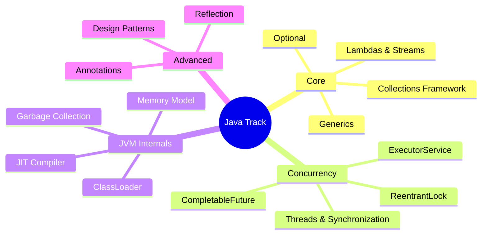

# Java Interview Prep

Deep dives into Java Core, Advanced, Concurrency, and JVM internals for SDE-2 interviews.

### 📚 Topic Visualization

### 📚 Topic Index

| Category | Topics Covered | Difficulty Level |
| :--- | :--- | :--- |
| **Core Java** | Collections, Generics, Lambdas, Streams, Optional | ⭐⭐ Medium |
| **Concurrency** | Threads, synchronized, ReentrantLock, ExecutorService, CompletableFuture | ⭐⭐⭐ Hard |
| **JVM Internals** | ClassLoader, JIT, Garbage Collection, Memory Model | ⭐⭐⭐ Hard |
| **Advanced** | Design Patterns in Java, Reflection, Annotations, Proxies | ⭐⭐ Medium |
| **Collections Internals** | HashMap, ConcurrentHashMap, LinkedHashMap, TreeMap | ⭐⭐⭐ Hard |
