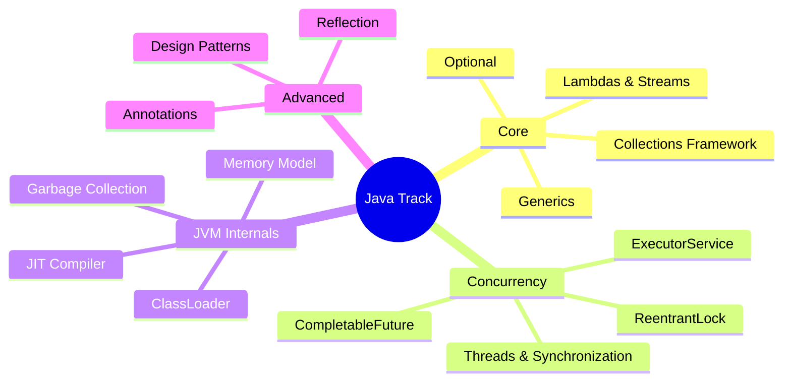

# Java Interview Prep

Deep dives into Java Core, Advanced, Concurrency, and JVM internals for SDE-2 interviews.

### 📚 Topic Visualization

### 📚 Topic Master Index

| Topic / Question | Read Document | Difficulty Level |
| :--- | :--- | :--- |
| Abstract Classes vs. Interfaces (Post-Java 9) | [Open ↗](/interview-ready/java/abstract-vs-interface-modern/) | ⭐⭐ Medium |
| Annotation Processors Internals | [Open ↗](/interview-ready/java/annotation-processors/) | ⭐⭐ Medium |
| Arrays.binarySearch() Negative Results | [Open ↗](/interview-ready/java/binarysearch-negatives/) | ⭐ Easy |
| Arrays.parallelSort() Internals | [Open ↗](/interview-ready/java/parallel-sort-internals/) | ⭐⭐ Medium |
| Arrays.sort vs. Collections.sort | [Open ↗](/interview-ready/java/sorting-internals-detailed/) | ⭐ Easy |
| AtomicReferenceFieldUpdater (Expert) | [Open ↗](/interview-ready/java/atomic-field-updaters/) | ⭐⭐ Medium |
| Checked vs. Unchecked Exceptions | [Open ↗](/interview-ready/java/checked-vs-unchecked-exceptions/) | ⭐⭐ Medium |
| Class.forName vs. ClassLoader | [Open ↗](/interview-ready/java/class-forname-vs-loadclass/) | ⭐ Easy |
| ClassLoader Hierarchy | [Open ↗](/interview-ready/java/classloader-hierarchy/) | ⭐⭐⭐ Hard |
| CompletableFuture Internals | [Open ↗](/interview-ready/java/completable-future-internals/) | ⭐⭐ Medium |
| CompletableFuture and Async Programming | [Open ↗](/interview-ready/java/completablefuture-async/) | ⭐⭐ Medium |
| Deadlocks: Detection, Prevention, and Avoidance | [Open ↗](/interview-ready/java/deadlocks/) | ⭐ Easy |
| Deep Dive: ConcurrentHashMap Internals | [Open ↗](/interview-ready/java/concurrenthashmap-internals/) | ⭐⭐⭐ Hard |
| Deep Dive: JVM Memory and GC Tuning | [Open ↗](/interview-ready/java/jvm-memory-and-gc-tuning/) | ⭐⭐⭐ Hard |
| Default Methods and the Diamond Problem | [Open ↗](/interview-ready/java/default-methods-diamond/) | ⭐⭐⭐ Hard |
| Design Patterns in Builder, Factory, Singleton, Observer | [Open ↗](/interview-ready/java/design-patterns/) | ⭐ Easy |
| Enum Internals and Performance | [Open ↗](/interview-ready/java/enum-internals/) | ⭐ Easy |
| EnumMap and EnumSet Performance | [Open ↗](/interview-ready/java/enumset-enummap-performance/) | ⭐⭐⭐ Hard |
| Final vs. Finally vs. Finalize | [Open ↗](/interview-ready/java/final-finally-finalize/) | ⭐ Easy |
| Finalizer vs. Cleaners | [Open ↗](/interview-ready/java/finalizer-cleaners/) | ⭐⭐ Medium |
| ForkJoinPool Internals | [Open ↗](/interview-ready/java/fork-join-pool/) | ⭐⭐ Medium |
| ForkJoinPool vs. ThreadPoolExecutor | [Open ↗](/interview-ready/java/forkjoinpool-vs-threadpool/) | ⭐ Easy |
| Functional Interface Internals | [Open ↗](/interview-ready/java/functional-interfaces-internals/) | ⭐⭐⭐ Hard |
| HashMap Internals and Resizing | [Open ↗](/interview-ready/java/hashmap-internals/) | ⭐⭐ Medium |
| Instanceof vs. GetClass() | [Open ↗](/interview-ready/java/instanceof-vs-getclass/) | ⭐⭐ Medium |
| Internal vs. External Iterators | [Open ↗](/interview-ready/java/internal-vs-external-iterators/) | ⭐⭐⭐ Hard |
| JVM Internals & Memory Management | [Open ↗](/interview-ready/java/jvm-internals/) | ⭐⭐⭐ Hard |
| Java 17+ Features: Records, Sealed Classes, Pattern Matching | [Open ↗](/interview-ready/java/java-modern-features/) | ⭐ Easy |
| Java 8 Stream vs. ParallelStream | [Open ↗](/interview-ready/java/stream-parallelism/) | ⭐⭐ Medium |
| Java ClassLoader and Reflection | [Open ↗](/interview-ready/java/classloader-reflection/) | ⭐⭐ Medium |
| Java Concurrency Basics | [Open ↗](/interview-ready/java/concurrency/) | ⭐⭐⭐ Hard |
| Java Flight Recorder (JFR) Internals | [Open ↗](/interview-ready/java/jfr-flight-recorder-internals/) | ⭐ Easy |
| Java Generics and Type Erasure | [Open ↗](/interview-ready/java/generics-type-erasure/) | ⭐⭐⭐ Hard |
| Java Memory Model (JMM) Happens-Before | [Open ↗](/interview-ready/java/jmm-happens-before/) | ⭐⭐ Medium |
| Java Memory Model and Happens-Before | [Open ↗](/interview-ready/java/java-memory-model/) | ⭐⭐⭐ Hard |
| Java Optional and Null Safety | [Open ↗](/interview-ready/java/java-optional/) | ⭐⭐⭐ Hard |
| Java Streams and Functional Programming | [Open ↗](/interview-ready/java/java-streams/) | ⭐⭐⭐ Hard |
| LongAdder vs. AtomicLong | [Open ↗](/interview-ready/java/longadder-vs-atomiclong/) | ⭐⭐ Medium |
| Low-latency G1 GC Tuning | [Open ↗](/interview-ready/java/g1gc-latency-tuning/) | ⭐ Easy |
| Marker Interfaces vs. Annotations | [Open ↗](/interview-ready/java/marker-interfaces-vs-annotations/) | ⭐⭐⭐ Hard |
| Method Handles vs. Reflection | [Open ↗](/interview-ready/java/method-handles/) | ⭐⭐⭐ Hard |
| MethodHandles vs. Reflection | [Open ↗](/interview-ready/java/methodhandles-vs-reflection/) | ⭐⭐ Medium |
| PhantomReferences (Cleanups) | [Open ↗](/interview-ready/java/phantom-references-detailed/) | ⭐⭐⭐ Hard |
| ProcessBuilder vs. Runtime.exec | [Open ↗](/interview-ready/java/processbuilder-vs-runtime/) | ⭐⭐ Medium |
| Records (Java 16+) | [Open ↗](/interview-ready/java/records-detailed/) | ⭐⭐ Medium |
| ReferenceQueue and Post-mortem Cleanup | [Open ↗](/interview-ready/java/reference-queue/) | ⭐⭐ Medium |
| SOLID Principles with Real-World Java | [Open ↗](/interview-ready/java/solid-principles/) | ⭐⭐ Medium |
| Sealed Classes (Java 17) | [Open ↗](/interview-ready/java/sealed-classes/) | ⭐⭐ Medium |
| SerialVersionUID and Versioning | [Open ↗](/interview-ready/java/serialversionuid-detailed/) | ⭐⭐ Medium |
| Service Provider Interface (SPI) | [Open ↗](/interview-ready/java/spi-internals/) | ⭐⭐⭐ Hard |
| Shallow vs. Deep Copy | [Open ↗](/interview-ready/java/shallow-vs-deep-copy/) | ⭐⭐⭐ Hard |
| Spliterators (Java 8+) | [Open ↗](/interview-ready/java/spliterators-detailed/) | ⭐⭐ Medium |
| StampedLock vs. ReadWriteLock | [Open ↗](/interview-ready/java/stampedlock-optimistic-read/) | ⭐⭐ Medium |
| String Deduplication vs. Interning | [Open ↗](/interview-ready/java/string-deduplication-interning/) | ⭐⭐ Medium |
| The Unsafe Class | [Open ↗](/interview-ready/java/unsafe-and-varhandles/) | ⭐ Easy |
| This vs. Super | [Open ↗](/interview-ready/java/this-vs-super/) | ⭐⭐ Medium |
| Thread Pools and ExecutorService Internals | [Open ↗](/interview-ready/java/thread-pool-internals/) | ⭐⭐ Medium |
| Thread.interrupt() and Cleanup | [Open ↗](/interview-ready/java/thread-interruption/) | ⭐⭐ Medium |
| Thread.onSpinWait() (High Latency) | [Open ↗](/interview-ready/java/thread-onspinwait-optimization/) | ⭐⭐ Medium |
| ThreadLocal Leaks | [Open ↗](/interview-ready/java/threadlocal-leaks/) | ⭐⭐ Medium |
| ThreadLocal vs. InheritableThreadLocal | [Open ↗](/interview-ready/java/inheritable-threadlocal/) | ⭐⭐⭐ Hard |
| ThreadLocalRandom vs. Random | [Open ↗](/interview-ready/java/threadlocalrandom-performance/) | ⭐ Easy |
| Transient vs. Volatile | [Open ↗](/interview-ready/java/transient-vs-volatile/) | ⭐⭐ Medium |
| VarHandle Internals (Expert) | [Open ↗](/interview-ready/java/varhandle-internals/) | ⭐⭐⭐ Hard |
| Virtual Threads (Project Loom) | [Open ↗](/interview-ready/java/virtual-threads-loom/) | ⭐⭐⭐ Hard |
| Volatile vs. Atomic | [Open ↗](/interview-ready/java/volatile-vs-atomic/) | ⭐ Easy |
| Weak, Soft, and Phantom References | [Open ↗](/interview-ready/java/reference-types/) | ⭐ Easy |
| WeakHashMap and GC Internals | [Open ↗](/interview-ready/java/weak-hashmap/) | ⭐⭐⭐ Hard |
| Yield vs. Sleep | [Open ↗](/interview-ready/java/thread-yield-vs-sleep/) | ⭐⭐ Medium |
