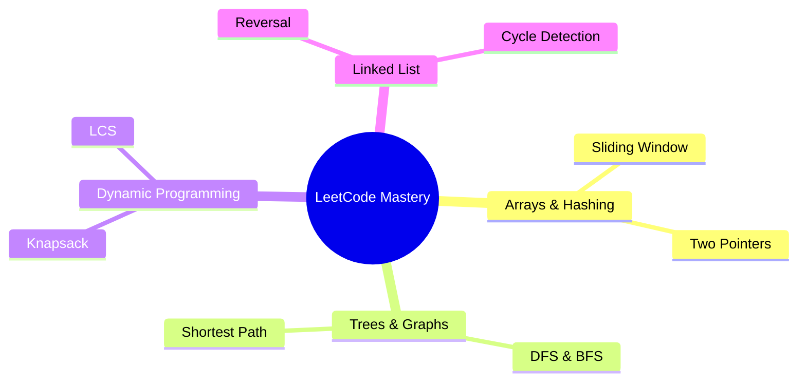

# LeetCode topic-wise mastery

Curated problems by pattern and data structure. Each write-up includes intuition, complexity, a Java solution, and follow-ups for senior interviews.

## Topic Visualization

## Master Question Index

### [Arrays](/interview-ready/leetcode/arrays/)

| # | Problem | Difficulty Level |
|---|--------|----|
| [1](/interview-ready/leetcode/arrays/two-sum/) | Two Sum | ⭐ Easy |
| [3](/interview-ready/leetcode/arrays/three-sum/) | 3Sum | ⭐⭐ Medium |
| [4](/interview-ready/leetcode/arrays/four-sum/) | 4Sum | ⭐⭐⭐ Hard |
| [8](/interview-ready/leetcode/arrays/product-except-self/) | Product of Array Except Self | ⭐⭐ Medium |
| [11](/interview-ready/leetcode/arrays/container-with-most-water/) | Container With Most Water | ⭐⭐ Medium |
| [42](/interview-ready/leetcode/arrays/trapping-rain-water/) | Trapping Rain Water | ⭐⭐⭐ Hard |
| [48](/interview-ready/leetcode/arrays/rotate-image/) | Rotate Image | ⭐⭐ Medium |
| [54](/interview-ready/leetcode/arrays/spiral-matrix/) | Spiral Matrix | ⭐⭐ Medium |
| [56](/interview-ready/leetcode/arrays/merge-intervals/) | Merge Intervals | ⭐⭐ Medium |
| [76](/interview-ready/leetcode/arrays/minimum-window-substring/) | Minimum Window Substring | ⭐⭐⭐ Hard |
| [128](/interview-ready/leetcode/arrays/longest-consecutive-sequence/) | Longest Consecutive Sequence | ⭐⭐ Medium |
| [152](/interview-ready/leetcode/arrays/maximum-product-subarray/) | Maximum Product Subarray | ⭐⭐ Medium |
| [239](/interview-ready/leetcode/arrays/sliding-window-maximum/) | Sliding Window Maximum | ⭐⭐⭐ Hard |
| [253](/interview-ready/leetcode/arrays/meeting-rooms-ii/) | Meeting Rooms II | ⭐⭐ Medium |
| [315](/interview-ready/leetcode/arrays/count-smaller-numbers/) | Count of Smaller Numbers After Self | ⭐⭐⭐ Hard |
| [340](/interview-ready/leetcode/arrays/longest-substring-k-distinct/) | Longest Substring with At Most K Distinct Characters | ⭐⭐ Medium |
| [347](/interview-ready/leetcode/arrays/top-k-frequent/) | Top K Frequent Elements | ⭐⭐ Medium |
| [438](/interview-ready/leetcode/arrays/find-all-anagrams/) | Find All Anagrams in a String | ⭐⭐ Medium |
| [560](/interview-ready/leetcode/arrays/subarray-sum-equals-k/) | Subarray Sum Equals K | ⭐⭐ Medium |
| [727](/interview-ready/leetcode/arrays/minimum-window-subsequence/) | Minimum Window Subsequence | ⭐⭐⭐ Hard |

### [Backtracking](/interview-ready/leetcode/backtracking/)

| # | Problem | Difficulty Level |
|---|--------|----|
| [39](/interview-ready/leetcode/backtracking/combination-sum/) | Combination Sum | ⭐⭐ Medium |
| [46](/interview-ready/leetcode/backtracking/permutations/) | Permutations | ⭐⭐ Medium |
| [51](/interview-ready/leetcode/backtracking/n-queens/) | N-Queens | ⭐⭐ Medium |
| [78](/interview-ready/leetcode/backtracking/subsets/) | Subsets | ⭐⭐ Medium |
| [212](/interview-ready/leetcode/backtracking/word-search-ii/) | Word Search II (Trie + Backtracking) | ⭐⭐⭐ Hard |

### [Binary Search](/interview-ready/leetcode/binary-search/)

| # | Problem | Difficulty Level |
|---|--------|----|
| [4](/interview-ready/leetcode/binary-search/median-two-sorted-arrays/) | Median of Two Sorted Arrays | ⭐⭐⭐ Hard |
| [33](/interview-ready/leetcode/binary-search/search-rotated-array/) | Search in Rotated Sorted Array | ⭐⭐ Medium |
| [74](/interview-ready/leetcode/binary-search/search-2d-matrix/) | Search a 2D Matrix | ⭐⭐ Medium |

### [Dynamic Programming](/interview-ready/leetcode/dynamic-programming/)

| # | Problem | Difficulty Level |
|---|--------|----|
| [55](/interview-ready/leetcode/dynamic-programming/jump-game/) | Jump Game I & II | ⭐⭐ Medium |
| [70](/interview-ready/leetcode/dynamic-programming/climbing-stairs/) | Climbing Stairs | ⭐ Easy |
| [72](/interview-ready/leetcode/dynamic-programming/edit-distance/) | Edit Distance | ⭐⭐⭐ Hard |
| [91](/interview-ready/leetcode/dynamic-programming/decode-ways/) | Decode Ways | ⭐⭐ Medium |
| [121](/interview-ready/leetcode/dynamic-programming/buy-sell-stock/) | Buy and Sell Stock | ⭐ Easy |
| [139](/interview-ready/leetcode/dynamic-programming/word-break/) | Word Break | ⭐⭐ Medium |
| [198](/interview-ready/leetcode/dynamic-programming/house-robber/) | House Robber | ⭐⭐ Medium |
| [300](/interview-ready/leetcode/dynamic-programming/longest-increasing-subsequence/) | Longest Increasing Subsequence | ⭐⭐ Medium |
| [309](/interview-ready/leetcode/dynamic-programming/buy-sell-stock-cooldown/) | Stock with Cooldown | ⭐⭐ Medium |
| [312](/interview-ready/leetcode/dynamic-programming/burst-balloons/) | Burst Balloons | ⭐⭐ Medium |
| [322](/interview-ready/leetcode/dynamic-programming/coin-change-2/) | Coin Change 2 | ⭐⭐ Medium |
| [322](/interview-ready/leetcode/dynamic-programming/coin-change/) | Coin Change | ⭐⭐ Medium |
| [1143](/interview-ready/leetcode/dynamic-programming/longest-common-subsequence/) | Longest Common Subsequence | ⭐⭐ Medium |

### [Graphs](/interview-ready/leetcode/graphs/)

| # | Problem | Difficulty Level |
|---|--------|----|
| [127](/interview-ready/leetcode/graphs/word-ladder/) | Word Ladder | ⭐⭐ Medium |
| [133](/interview-ready/leetcode/graphs/clone-graph/) | Clone Graph | ⭐⭐ Medium |
| [200](/interview-ready/leetcode/graphs/number-of-islands/) | Number of Islands | ⭐⭐ Medium |
| [207](/interview-ready/leetcode/graphs/course-schedule/) | Course Schedule | ⭐⭐ Medium |
| [332](/interview-ready/leetcode/graphs/reconstruct-itinerary/) | Reconstruct Itinerary | ⭐⭐⭐ Hard |
| [417](/interview-ready/leetcode/graphs/pacific-atlantic-water-flow/) | Pacific Atlantic Water Flow | ⭐⭐ Medium |
| [684](/interview-ready/leetcode/graphs/redundant-connection/) | Redundant Connection | ⭐⭐ Medium |
| [785](/interview-ready/leetcode/graphs/bipartite-graph/) | Is Graph Bipartite? | ⭐⭐ Medium |
| [-](/interview-ready/leetcode/graphs/dijkstra-algorithm/) | Dijkstra's Shortest Path Algorithm | ⭐⭐ Medium |

### [Heaps](/interview-ready/leetcode/heaps/)

| # | Problem | Difficulty Level |
|---|--------|----|
| [23](/interview-ready/leetcode/heaps/merge-k-sorted-lists/) | Merge K Sorted Lists | ⭐⭐⭐ Hard |
| [295](/interview-ready/leetcode/heaps/median-from-data-stream/) | Find Median from Data Stream | ⭐⭐⭐ Hard |
| [621](/interview-ready/leetcode/heaps/task-scheduler/) | Task Scheduler | ⭐⭐ Medium |

### [Linked List](/interview-ready/leetcode/linked-list/)

| # | Problem | Difficulty Level |
|---|--------|----|
| [21](/interview-ready/leetcode/linked-list/merge-two-sorted-lists/) | Merge Two Sorted Lists | ⭐ Easy |
| [25](/interview-ready/leetcode/linked-list/reverse-nodes-k-group/) | Reverse Nodes in K-Group | ⭐⭐⭐ Hard |
| [138](/interview-ready/leetcode/linked-list/copy-list-random-pointer/) | Copy List with Random Pointer | ⭐⭐ Medium |
| [141](/interview-ready/leetcode/linked-list/linked-list-cycle/) | Linked List Cycle | ⭐ Easy |
| [146](/interview-ready/leetcode/linked-list/lru-cache/) | LRU Cache | ⭐⭐ Medium |

### [Stacks](/interview-ready/leetcode/stacks/)

| # | Problem | Difficulty Level |
|---|--------|----|
| [20](/interview-ready/leetcode/stacks/valid-parentheses/) | Valid Parentheses | ⭐ Easy |
| [84](/interview-ready/leetcode/stacks/largest-rectangle-histogram/) | Largest Rectangle in Histogram | ⭐⭐⭐ Hard |
| [155](/interview-ready/leetcode/stacks/min-stack/) | Min Stack | ⭐⭐ Medium |
| [227](/interview-ready/leetcode/stacks/basic-calculator/) | Basic Calculator II | ⭐⭐ Medium |
| [739](/interview-ready/leetcode/stacks/daily-temperatures/) | Daily Temperatures | ⭐⭐ Medium |

### [Strings](/interview-ready/leetcode/strings/)

| # | Problem | Difficulty Level |
|---|--------|----|
| [5](/interview-ready/leetcode/strings/longest-palindromic-substring/) | Longest Palindromic Substring | ⭐⭐ Medium |
| [1392](/interview-ready/leetcode/strings/kmp-algorithm/) | Longest Happy Prefix (KMP) | ⭐⭐ Medium |

### [Trees](/interview-ready/leetcode/trees/)

| # | Problem | Difficulty Level |
|---|--------|----|
| [98](/interview-ready/leetcode/trees/validate-bst/) | Validate Binary Search Tree | ⭐⭐ Medium |
| [102](/interview-ready/leetcode/trees/level-order-traversal/) | Binary Tree Level Order Traversal | ⭐⭐ Medium |
| [124](/interview-ready/leetcode/trees/max-path-sum/) | Binary Tree Maximum Path Sum | ⭐⭐⭐ Hard |
| [199](/interview-ready/leetcode/trees/right-side-view/) | Binary Tree Right Side View | ⭐⭐ Medium |
| [235](/interview-ready/leetcode/trees/lowest-common-ancestor/) | Lowest Common Ancestor | ⭐ Easy |
| [297](/interview-ready/leetcode/trees/serialize-deserialize-tree/) | Serialize and Deserialize Binary Tree | ⭐⭐ Medium |
| [543](/interview-ready/leetcode/trees/diameter-of-binary-tree/) | Diameter of Binary Tree | ⭐⭐ Medium |
| [572](/interview-ready/leetcode/trees/subtree-of-another-tree/) | Subtree of Another Tree | ⭐⭐ Medium |
