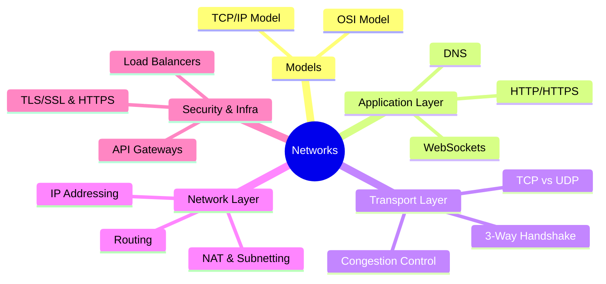

# Computer Networks Interview Prep

Deep dives into networking fundamentals for SDE-2 interviews at top product companies.

### 📚 Topic Visualization

### 📚 Topic Index

| Category | Topics Covered | Difficulty Level |
| :--- | :--- | :--- |
| **OSI & TCP/IP Models** | Layers, protocols, responsibilities | ⭐ Easy |
| **Application Layer** | HTTP/HTTPS, REST, DNS, CDN, WebSockets | ⭐⭐ Medium |
| **Transport Layer** | TCP vs. UDP, 3-way handshake, flow/congestion control | ⭐⭐⭐ Hard |
| **Network Layer** | IP addressing, routing, NAT, subnetting | ⭐⭐ Medium |
| **Security** | TLS/SSL, HTTPS, man-in-the-middle, certificates | ⭐⭐⭐ Hard |
| **Real-World Systems** | Load balancers, API Gateways, proxies | ⭐⭐⭐ Hard |
