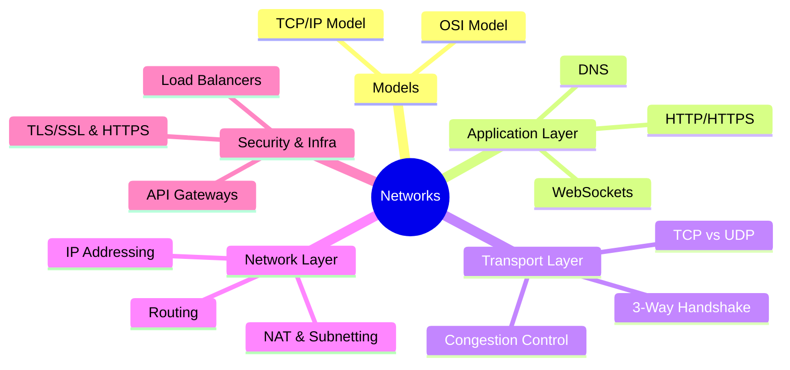

# Computer Networks Interview Prep

Deep dives into networking fundamentals for SDE-2 interviews at top product companies.

### 📚 Topic Visualization

### 📚 Topic Master Index

| Topic / Question | Read Document | Difficulty Level |
| :--- | :--- | :--- |
| DNS: Resolution, Types, and CDN | [Open ↗](/networks/dns/) | ⭐⭐⭐ Hard |
| HTTP, HTTPS, and TLS Deep Dive | [Open ↗](/networks/https-tls/) | ⭐ Easy |
| Load Balancing and API Gateway | [Open ↗](/networks/load-balancing/) | ⭐⭐⭐ Hard |
| Network Security: REST API Security and Common Attacks | [Open ↗](/networks/api-security/) | ⭐⭐ Medium |
| Networks: Anycast Routing vs Unicast | [Open ↗](/networks/anycast-vs-unicast/) | ⭐⭐ Medium |
| Networks: BGP Hijacking and Anycast Routing | [Open ↗](/networks/bgp-anycast/) | ⭐⭐⭐ Hard |
| Networks: CDN and Edge Side Includes (ESI) | [Open ↗](/networks/cdn-internals/) | ⭐⭐⭐ Hard |
| Networks: CORS (Preflight and Simple) | [Open ↗](/networks/cors-preflight/) | ⭐ Easy |
| Networks: DNS Resolution (Recursive vs. Iterative) | [Open ↗](/networks/dns-resolution-logic/) | ⭐⭐⭐ Hard |
| Networks: DNS Resolution (Recursive vs. Iterative) | [Open ↗](/networks/dns-resolution-detailed/) | ⭐⭐⭐ Hard |
| Networks: DNS over HTTPS (DoH) | [Open ↗](/networks/dns-over-https/) | ⭐⭐ Medium |
| Networks: DNS over HTTPS vs. DNS over TLS | [Open ↗](/networks/doh-vs-dot-detailed/) | ⭐⭐⭐ Hard |
| Networks: DNS over TLS (DoT) Internals | [Open ↗](/networks/dot-vs-doh/) | ⭐⭐ Medium |
| Networks: HTTP 1.1 vs. 2.0 vs. 3.0 | [Open ↗](/networks/http-versions-evolution/) | ⭐⭐ Medium |
| Networks: HTTP Headers (ETag and Caching) | [Open ↗](/networks/etags-and-caching/) | ⭐ Easy |
| Networks: HTTP Security Headers | [Open ↗](/networks/http-security-headers/) | ⭐⭐⭐ Hard |
| Networks: HTTP/2 HPACK (Header Compression) | [Open ↗](/networks/hpack-compression-detailed/) | ⭐⭐⭐ Hard |
| Networks: HTTP/3 (QUIC) and HOL Blocking | [Open ↗](/networks/http3-quic-detailed/) | ⭐⭐⭐ Hard |
| Networks: Multipath TCP (MPTCP) | [Open ↗](/networks/multipath-tcp-detailed/) | ⭐ Easy |
| Networks: QUIC Protocol | [Open ↗](/networks/quic-protocol/) | ⭐⭐ Medium |
| Networks: Socket Programming (TCP/UDP) | [Open ↗](/networks/socket-programming-lifecycle/) | ⭐⭐ Medium |
| Networks: TCP 3-Way Handshake vs. 4-Way Teardown | [Open ↗](/networks/tcp-handshake-teardown/) | ⭐⭐⭐ Hard |
| Networks: TCP Congestion Control (Slow Start) | [Open ↗](/networks/tcp-congestion-control/) | ⭐ Easy |
| Networks: TCP Keep-Alive vs. WebSockets | [Open ↗](/networks/keep-alive-vs-websockets/) | ⭐ Easy |
| Networks: TLS 1.3 Handshake (Perfect Forward Secrecy) | [Open ↗](/networks/tls-handshake-detailed/) | ⭐⭐⭐ Hard |
| Networks: TLS 1.3 vs. 1.2 Performance | [Open ↗](/networks/tls-13-performance/) | ⭐⭐ Medium |
| Networks: WebSocket Handshake Internals | [Open ↗](/networks/websocket-handshake-detailed/) | ⭐ Easy |
| Networks: WebSockets vs. SSE (Server-Sent Events) | [Open ↗](/networks/sse-vs-websockets/) | ⭐⭐ Medium |
| Networks: XSS vs. CSRF | [Open ↗](/networks/xss-vs-csrf-detailed/) | ⭐⭐⭐ Hard |
| Networks: Zero-Copy (Performance) | [Open ↗](/networks/zero-copy-internals/) | ⭐⭐ Medium |
| Networks: gRPC vs. REST | [Open ↗](/networks/grpc-vs-rest/) | ⭐⭐ Medium |
| OSI Model and TCP/IP Stack | [Open ↗](/networks/osi-model/) | ⭐ Easy |
| TCP vs UDP: Internals, Use Cases, and Trade-offs | [Open ↗](/networks/tcp-vs-udp/) | ⭐⭐⭐ Hard |
| WebSockets and Real-Time Communication | [Open ↗](/networks/websockets/) | ⭐⭐ Medium |
