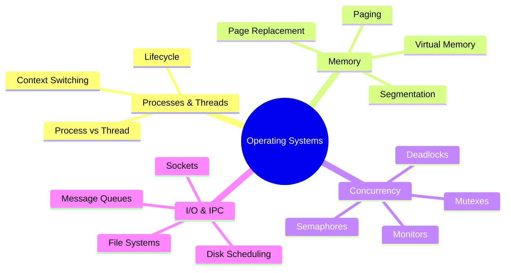

# Operating Systems Interview Prep

Deep dives into OS fundamentals for SDE-2 interviews at top product companies.

### 📚 Topic Visualization

### 📚 Topic Master Index

| Topic / Question | Read Document | Difficulty Level |
| :--- | :--- | :--- |
| CPU Scheduling Algorithms | [Open ↗](/os/cpu-scheduling/) | ⭐⭐⭐ Hard |
| Memory Management: Paging, Virtual Memory, and Page Faults | [Open ↗](/os/virtual-memory-paging/) | ⭐⭐ Medium |
| OS: Amdahl's Law (Parallel Limits) | [Open ↗](/os/amdahls-law/) | ⭐⭐ Medium |
| OS: CPU Affinity and Pinning | [Open ↗](/os/cpu-affinity/) | ⭐⭐ Medium |
| OS: Context Switch Internals | [Open ↗](/os/context-switch-detailed/) | ⭐⭐⭐ Hard |
| OS: Context Switching Overhead | [Open ↗](/os/context-switching-internals/) | ⭐⭐⭐ Hard |
| OS: Deadlock (The 4 Conditions) | [Open ↗](/os/deadlock-conditions/) | ⭐ Easy |
| OS: Disk Scheduling (SCAN vs. C-SCAN) | [Open ↗](/os/disk-scheduling-algorithms/) | ⭐⭐ Medium |
| OS: Disk Scheduling (SCAN vs. C-SCAN) | [Open ↗](/os/disk-scheduling-detailed/) | ⭐⭐ Medium |
| OS: File System Internals and I/O Scheduling | [Open ↗](/os/file-system-io/) | ⭐⭐ Medium |
| OS: Fork vs. Exec (Copy-on-Write) | [Open ↗](/os/fork-vs-exec/) | ⭐⭐ Medium |
| OS: Hard Links vs. Soft Links | [Open ↗](/os/hard-vs-soft-links/) | ⭐⭐⭐ Hard |
| OS: Inter-Process Communication (IPC) | [Open ↗](/os/inter-process-communication/) | ⭐⭐⭐ Hard |
| OS: Internal vs. External Fragmentation | [Open ↗](/os/memory-fragmentation/) | ⭐⭐⭐ Hard |
| OS: Inverted Page Table | [Open ↗](/os/inverted-page-tables/) | ⭐⭐ Medium |
| OS: Multilevel Paging | [Open ↗](/os/multilevel-paging/) | ⭐⭐ Medium |
| OS: Page Replacement - LRU vs. Clock | [Open ↗](/os/page-replacement-algorithms/) | ⭐⭐ Medium |
| OS: Page Table Entry (PTE) Bits | [Open ↗](/os/page-table-entry-bits/) | ⭐ Easy |
| OS: Segments vs. Pages | [Open ↗](/os/paging-vs-segmentation/) | ⭐⭐⭐ Hard |
| OS: Semaphores vs. Mutexes | [Open ↗](/os/semaphores-vs-mutexes/) | ⭐⭐ Medium |
| OS: Spinlocks vs. Mutexes | [Open ↗](/os/spinlocks-vs-mutexes/) | ⭐⭐ Medium |
| OS: Stepping through a Page Fault | [Open ↗](/os/page-fault-lifecycle/) | ⭐⭐ Medium |
| OS: System Calls and User Space vs Kernel Space | [Open ↗](/os/system-calls/) | ⭐ Easy |
| OS: Thrashing and Inverted Page Tables | [Open ↗](/os/thrashing-and-page-tables/) | ⭐⭐⭐ Hard |
| OS: Thrashing and the Working Set Model | [Open ↗](/os/thrashing-working-set/) | ⭐⭐ Medium |
| OS: Translation Lookaside Buffer (TLB) | [Open ↗](/os/tlb-internals/) | ⭐⭐ Medium |
| OS: User Mode vs. Kernel Mode | [Open ↗](/os/user-vs-kernel-mode/) | ⭐⭐ Medium |
| OS: Virtual Memory - Dirty and Reference Bits | [Open ↗](/os/page-table-bits/) | ⭐⭐ Medium |
| OS: Virtual Memory and Swapping | [Open ↗](/os/virtual-memory-detailed/) | ⭐⭐ Medium |
| OS: Virtualization vs. Containerization | [Open ↗](/os/virtualization-vs-containers/) | ⭐⭐ Medium |
| OS: Zombie vs. Orphan Processes | [Open ↗](/os/zombie-orphan/) | ⭐⭐⭐ Hard |
| Operating Systems: I/O Models (Blocking, Non-Blocking, Async) | [Open ↗](/os/io-models/) | ⭐⭐ Medium |
| Processes vs Threads in OS | [Open ↗](/os/processes-vs-threads/) | ⭐⭐ Medium |
| Semaphores, Mutexes, and Monitors | [Open ↗](/os/semaphores-mutexes/) | ⭐⭐ Medium |
