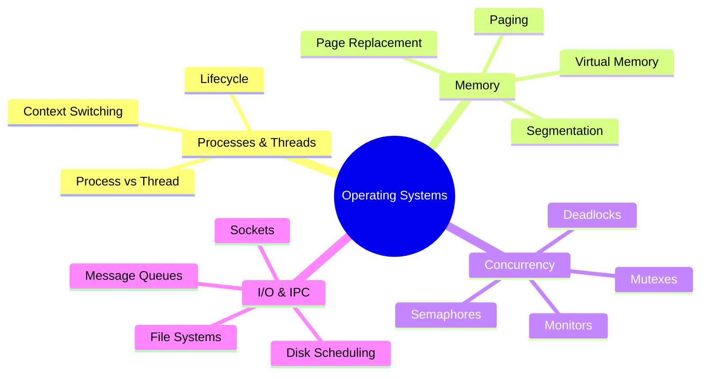

# Operating Systems Interview Prep

Deep dives into OS fundamentals for SDE-2 interviews at top product companies.

### 📚 Topic Visualization

### 📚 Topic Index

| Category | Topics Covered | Difficulty Level |
| :--- | :--- | :--- |
| **Processes & Threads** | Lifecycle, scheduling, context switching | ⭐⭐ Medium |
| **Memory Management** | Paging, segmentation, virtual memory, page replacement | ⭐⭐⭐ Hard |
| **Concurrency & Synchronization** | Mutexes, semaphores, deadlocks, monitors | ⭐⭐⭐ Hard |
| **Inter-Process Communication** | Pipes, message queues, shared memory, sockets | ⭐⭐ Medium |
| **File Systems & I/O** | Disk scheduling, caching, journaling | ⭐⭐ Medium |
| **Scheduling Algorithms** | FCFS, SJF, Round Robin, Priority, CFS | ⭐⭐ Medium |
