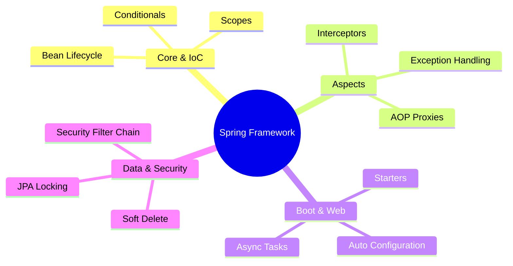

# Spring Interview Prep

Deep dives into Spring Boot, IoC, AOP, and Data for SDE-2 interviews.

### 📚 Topic Visualization

### 📚 Topic Master Index

| Topic / Question | Read Document | Difficulty Level |
| :--- | :--- | :--- |
| Hibernate: Soft Deletes (@SQLDelete) | [Open ↗](/spring/hibernate-soft-delete/) | ⭐⭐ Medium |
| JPA: Optimistic vs. Pessimistic Locking | [Open ↗](/spring/jpa-locking/) | ⭐⭐⭐ Hard |
| Spring Boot: Actuator and Monitoring | [Open ↗](/spring/spring-boot-actuator/) | ⭐⭐ Medium |
| Spring Boot: Auto-configuration Internals | [Open ↗](/spring/auto-configuration-detailed/) | ⭐ Easy |
| Spring Boot: Commandline vs Application Runner | [Open ↗](/spring/runners-startup/) | ⭐ Easy |
| Spring Boot: Custom Starters | [Open ↗](/spring/custom-spring-boot-starters/) | ⭐ Easy |
| Spring Boot: Logging (Logback/MDC) | [Open ↗](/spring/logging-mdc/) | ⭐ Easy |
| Spring Boot: Testing Slices (@DataJpaTest) | [Open ↗](/spring/spring-test-slices/) | ⭐⭐ Medium |
| Spring Data JPA: L1 and L2 Caching | [Open ↗](/spring/hibernate-caching-layers/) | ⭐⭐ Medium |
| Spring Data JPA: N+1 Problem | [Open ↗](/spring/jpa-n-plus-one/) | ⭐⭐ Medium |
| Spring Data: Specification API | [Open ↗](/spring/jpa-specifications/) | ⭐⭐ Medium |
| Spring Security: Filter Chain Internals | [Open ↗](/spring/spring-security-filter-chain/) | ⭐⭐ Medium |
| Spring Security: OAuth2 and OIDC | [Open ↗](/spring/oauth2-oidc-security/) | ⭐⭐ Medium |
| Spring WebFlux: Reactive Programming | [Open ↗](/spring/webflux-reactive/) | ⭐⭐⭐ Hard |
| Spring: @ConditionalOnMissingBean | [Open ↗](/spring/spring-conditionals/) | ⭐⭐ Medium |
| Spring: AOP Proxies (JDK vs. CGLIB) | [Open ↗](/spring/aop-proxies/) | ⭐⭐⭐ Hard |
| Spring: Application Event Handling | [Open ↗](/spring/application-events/) | ⭐⭐ Medium |
| Spring: Async Methods (@Async) | [Open ↗](/spring/async-methods/) | ⭐⭐ Medium |
| Spring: Bean Lifecycle | [Open ↗](/spring/bean-lifecycle/) | ⭐⭐ Medium |
| Spring: Bean Scopes | [Open ↗](/spring/bean-scopes-detailed/) | ⭐⭐⭐ Hard |
| Spring: Circular Dependencies | [Open ↗](/spring/circular-dependencies/) | ⭐⭐⭐ Hard |
| Spring: Content Negotiation | [Open ↗](/spring/content-negotiation/) | ⭐⭐⭐ Hard |
| Spring: Global Exception Handling | [Open ↗](/spring/global-exception-handling/) | ⭐ Easy |
| Spring: Profiles and Environment Config | [Open ↗](/spring/profiles-environment/) | ⭐⭐ Medium |
| Spring: Resilience and Retries | [Open ↗](/spring/resilience-retries/) | ⭐⭐ Medium |
| Spring: RestTemplate Error Handling | [Open ↗](/spring/rest-error-handling/) | ⭐⭐⭐ Hard |
| Spring: RestTemplate vs. WebClient vs. Feign | [Open ↗](/spring/rest-clients-comparison/) | ⭐⭐⭐ Hard |
| Spring: Scheduler (@Scheduled) | [Open ↗](/spring/spring-scheduling/) | ⭐ Easy |
| Spring: Transaction Propagation | [Open ↗](/spring/transaction-propagation/) | ⭐ Easy |
| Spring: Validation (@Valid vs. @Validated) | [Open ↗](/spring/spring-validation/) | ⭐⭐ Medium |
