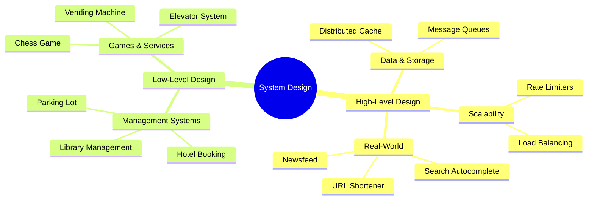

# System Design Interview Prep

Deep dives into High-Level Design (HLD) and Low-Level Design (LLD) for SDE-2 interviews.

### 📚 Topic Visualization

### 📚 Topic Master Index

| Topic / Question | Read Document | Difficulty Level |
| :--- | :--- | :--- |
| Cache Penetration, Breakdown, and Avalanche | [Open ↗](/system-design/cache-failure-scenarios/) | ⭐⭐⭐ Hard |
| Consistency Levels (Strong vs. Eventual) | [Open ↗](/system-design/consistency-levels-detailed/) | ⭐⭐ Medium |
| Design Reverse Proxy (Nginx Internals) | [Open ↗](/system-design/reverse-proxy-nginx/) | ⭐⭐ Medium |
| Design TinyURL (Distributed) | [Open ↗](/system-design/tinyurl-detailed/) | ⭐⭐ Medium |
| Design Twitter (The Feed) | [Open ↗](/system-design/twitter-feed-architectures/) | ⭐ Easy |
| Design Twitter/News Feed (HLD) | [Open ↗](/system-design/news-feed-twitter/) | ⭐⭐⭐ Hard |
| Design Vector Clocks (Conflict Resolution) | [Open ↗](/system-design/vector-clocks-conflict/) | ⭐⭐ Medium |
| Design a CDN (Content Delivery Network) | [Open ↗](/system-design/cdn-detailed-routing/) | ⭐ Easy |
| Design a Distributed Chat App (WhatsApp) | [Open ↗](/system-design/chat-app-whatsapp/) | ⭐ Easy |
| Design a Distributed Lock | [Open ↗](/system-design/distributed-lock-detailed/) | ⭐ Easy |
| Design a Distributed Lock | [Open ↗](/system-design/distributed-lock/) | ⭐ Easy |
| Design a Distributed Metrics System | [Open ↗](/system-design/metrics-system/) | ⭐⭐ Medium |
| Design a Global Rate Limiter | [Open ↗](/system-design/rate-limiter/) | ⭐ Easy |
| Design a Key-Value Store (Consistent Hashing) | [Open ↗](/system-design/key-value-store/) | ⭐⭐ Medium |
| Design a Key-Value Store (LSM Trees) | [Open ↗](/system-design/lsm-key-value-store/) | ⭐⭐⭐ Hard |
| Design a Key-Value Store (Partitioning) | [Open ↗](/system-design/key-value-partitioning/) | ⭐ Easy |
| Design a Notification System | [Open ↗](/system-design/notification-system-detailed/) | ⭐⭐⭐ Hard |
| Design a Rate Limiter | [Open ↗](/system-design/rate-limiter-algorithms/) | ⭐⭐⭐ Hard |
| Design a Ride-Sharing System (Uber/Ola) | [Open ↗](/system-design/ride-sharing/) | ⭐⭐⭐ Hard |
| Design a Search Autocomplete System | [Open ↗](/system-design/search-autocomplete/) | ⭐ Easy |
| Design a Search Typeahead (Autocomplete) | [Open ↗](/system-design/search-autocomplete-detailed/) | ⭐⭐⭐ Hard |
| Design a Web Crawler | [Open ↗](/system-design/web-crawler/) | ⭐⭐ Medium |
| Design a Web Crawler | [Open ↗](/system-design/web-crawler-logic/) | ⭐⭐ Medium |
| Design an API Gateway | [Open ↗](/system-design/api-gateway-responsibilities/) | ⭐⭐ Medium |
| Design an Ad Click Counter | [Open ↗](/system-design/ad-click-counter/) | ⭐⭐⭐ Hard |
| Design an Image Hosting Backend (S3 + CDN) | [Open ↗](/system-design/image-hosting-detailed/) | ⭐ Easy |
| Distributed Cache (Redis Deep Dive) | [Open ↗](/system-design/distributed-cache/) | ⭐ Easy |
| Distributed ID Generator (Snowflake) | [Open ↗](/system-design/distributed-id-snowflake/) | ⭐⭐⭐ Hard |
| Distributed Message Queue (Kafka vs SQS) | [Open ↗](/system-design/message-queue-detailed/) | ⭐ Easy |
| Distributed Rate Limiter | [Open ↗](/system-design/distributed-rate-limiter/) | ⭐ Easy |
| Distributed Scheduler (Cron) | [Open ↗](/system-design/distributed-scheduler/) | ⭐⭐ Medium |
| Distributed Wallet (2PC vs. Saga) | [Open ↗](/system-design/distributed-wallet-saga/) | ⭐ Easy |
| Hotel Booking System (LLD) | [Open ↗](/system-design/hotel-booking-lld/) | ⭐⭐ Medium |
| Library Management System (LLD) | [Open ↗](/system-design/library-management-lld/) | ⭐⭐⭐ Hard |
| Message Queue and Event-Driven Architecture | [Open ↗](/system-design/message-queue-kafka/) | ⭐⭐ Medium |
| Metrics & Monitoring (Prometheus) | [Open ↗](/system-design/metrics-monitoring-prometheus/) | ⭐ Easy |
| Notification System | [Open ↗](/system-design/notification-system-design/) | ⭐⭐ Medium |
| Parking Lot LLD | [Open ↗](/system-design/parking-lot-lld/) | ⭐⭐ Medium |
| Recommendation Systems | [Open ↗](/system-design/recommendation-system-basics/) | ⭐⭐ Medium |
| Scalable Notification System (HLD) | [Open ↗](/system-design/notification-system-hld/) | ⭐ Easy |
| URL Shortener (HLD) | [Open ↗](/system-design/url-shortener/) | ⭐⭐⭐ Hard |
