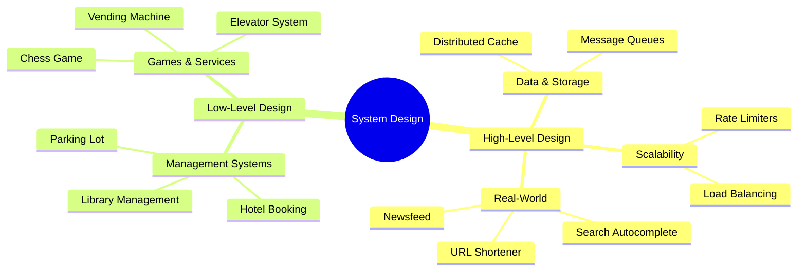

# System Design Interview Prep

Deep dives into High-Level Design (HLD) and Low-Level Design (LLD) for SDE-2 interviews.

### 📚 Topic Visualization

### 📚 Topic Index

| Category | Topics Covered | Difficulty Level |
| :--- | :--- | :--- |
| **High-Level Design (HLD) Part 1** | URL Shortener, Rate Limiter, Notification System, Logging System | ⭐⭐ Medium |
| **High-Level Design (HLD) Part 2** | Search Autocomplete, Newsfeed, Ride-Sharing, Payment Gateway | ⭐⭐⭐ Hard |
| **High-Level Design (HLD) Part 3** | Distributed Cache, Message Queue, Video Streaming | ⭐⭐⭐ Hard |
| **Low-Level Design (LLD) Part 1** | Parking Lot, Library Management, Hotel Booking, Movie Ticket Booking | ⭐⭐⭐ Hard |
| **Low-Level Design (LLD) Part 2** | Elevator System, Chess Game, Snake and Ladder, ATM Machine | ⭐⭐⭐ Hard |
| **Low-Level Design (LLD) Part 3** | File System, Vending Machine, LinkedIn + Twitter Feed Design | ⭐⭐⭐ Hard |
